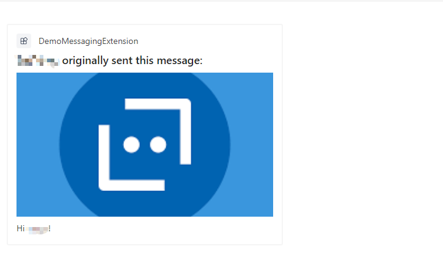
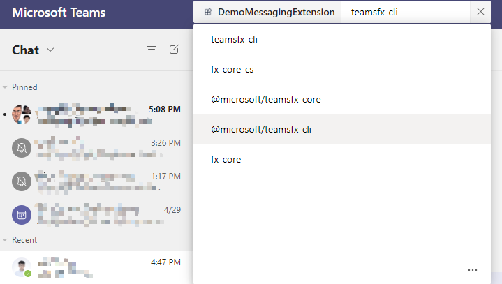
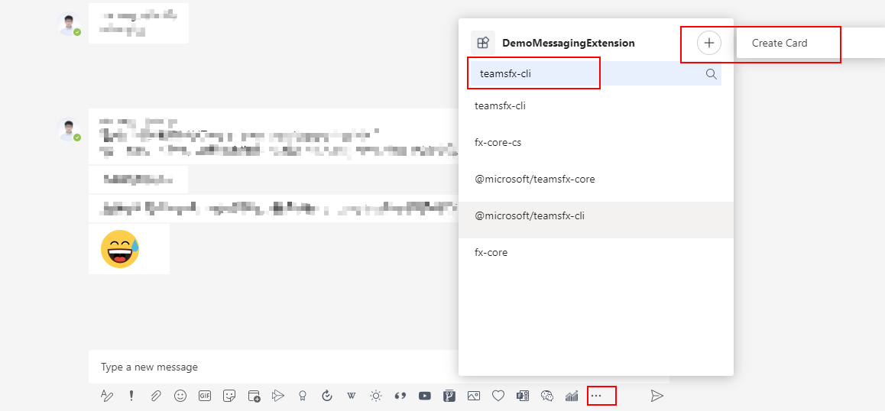
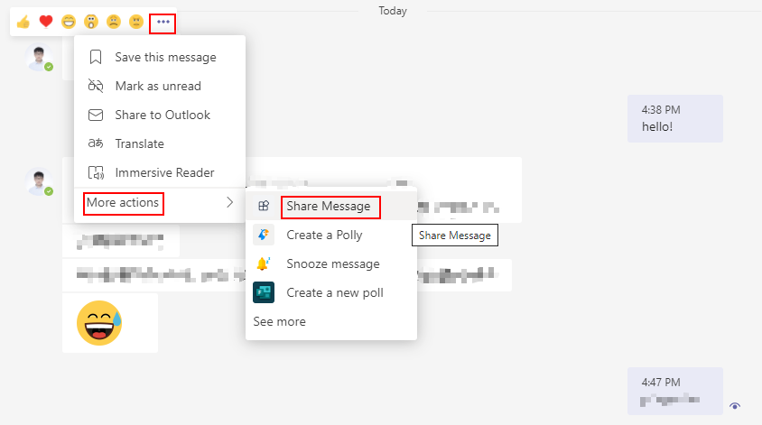

# How to use this Bots and Message Extensions app

A bot, chatbot, or conversational bot is an app that responds to simple commands sent in chat and replies in meaningful ways. Examples of bots in everyday use include: bots that notify about build failures, bots that provide information about the weather or bus schedules, or provide travel information. A bot interaction can be a quick question and answer, or it can be a complex conversation. Being a cloud application, a bot can provide valuable and secure access to cloud services and corporate resources.

A Message Extension allows users to interact with your web service while composing messages in the Microsoft Teams client. Users can invoke your web service to assist message composition, from the message compose box, or from the search bar.

Message Extensions are implemented on top of the Bot support architecture within Teams.

This is a simple hello world application with both Bot and Message extension capabilities.

## Prerequisites

- [Node.js](https://nodejs.org/en/), supported versions: 14, 16, 18
- An M365 account. If you do not have M365 account, apply one from [M365 developer program](https://developer.microsoft.com/en-us/microsoft-365/dev-program)
- [Teams Toolkit Visual Studio Code Extension](https://aka.ms/teams-toolkit) version after 1.55 or [TeamsFx CLI](https://aka.ms/teamsfx-cli)

## Debug

- From Visual Studio Code: Start debugging the project by hitting the `F5` key in Visual Studio Code. 
- Alternatively use the `Run and Debug Activity Panel` in Visual Studio Code and click the `Run and Debug` green arrow button.
- From TeamsFx CLI: Start debugging the project by executing the command `teamsfx preview --local` in your project directory.

## Edit the manifest

You can find the Teams app manifest in `templates/appPackage` folder. The folder contains one manifest file:
* `manifest.template.json`: Manifest file for Teams app running locally or running remotely (After deployed to Azure).

This file contains template arguments with `{...}` statements which will be replaced at build time. You may add any extra properties or permissions you require to this file. See the [schema reference](https://docs.microsoft.com/en-us/microsoftteams/platform/resources/schema/manifest-schema) for more information.

## Deploy to Azure

Deploy your project to Azure by following these steps:

| From Visual Studio Code                                                                                                                                                                                                                                                                                                                                                  | From TeamsFx CLI                                                                                                                                                                                                                    |
| :----------------------------------------------------------------------------------------------------------------------------------------------------------------------------------------------------------------------------------------------------------------------------------------------------------------------------------------------------------------------- | :---------------------------------------------------------------------------------------------------------------------------------------------------------------------------------------------------------------------------------- |
| <ul><li>Open Teams Toolkit, and sign into Azure by clicking the `Sign in to Azure` under the `ACCOUNTS` section from sidebar.</li> <li>After you signed in, select a subscription under your account.</li><li>Open the Teams Toolkit and click `Provision in the cloud` from DEPLOYMENT section or open the command palette and select: `Teams: Provision in the cloud`.</li><li>Open the Teams Toolkit and click `Deploy to the cloud` or open the command palette and select: `Teams: Deploy to the cloud`.</li></ul> | <ul> <li>Run command `teamsfx account login azure`.</li> <li>Run command `teamsfx account set --subscription <your-subscription-id>`.</li> <li> Run command `teamsfx provision`.</li> <li>Run command: `teamsfx deploy`. </li></ul> |

> Note: Provisioning and deployment may incur charges to your Azure Subscription.

## Preview

Once the provisioning and deployment steps are finished, you can preview your app:

- From Visual Studio Code

  1. Open the `Run and Debug Activity Panel`.
  1. Select `Launch Remote (Edge)` or `Launch Remote (Chrome)` from the launch configuration drop-down.
  1. Press the Play (green arrow) button to launch your app - now running remotely from Azure.

- From TeamsFx CLI: execute `teamsfx preview --remote` in your project directory to launch your application.

## Validate manifest file

To check that your manifest file is valid:

- From Visual Studio Code: open the command palette and select: `Teams: Validate manifest file`.
- From TeamsFx CLI: run command `teamsfx validate` in your project directory.

## Package

- From Visual Studio Code: open the Teams Toolkit and click `Zip Teams metadata package` or open the command palette and select `Teams: Zip Teams metadata package`.
- Alternatively, from the command line run `teamsfx package` in the project directory.

## Publish to Teams

Once deployed, you may want to distribute your application to your organization's internal app store in Teams. Your app will be submitted for admin approval.

- From Visual Studio Code: open the Teams Toolkit and click `Publish to Teams` or open the command palette and select: `Teams: Publish to Teams`.
- From TeamsFx CLI: run command `teamsfx publish` in your project directory.

## Play with Messging Extension

This template provides some sample functionality:

- You can search for `npm` packages from the search bar.

- You can create and send an adaptive card.

  

- You can share a message in an adaptive card form.

  

- You can paste a link that "unfurls" (`.botframework.com` is monitored in this template) and a card will be rendered.

  

To trigger these functions, there are multiple entry points:

- `@mention` Your message extension, from the `search box area`.

  

- `@mention` your message extension from the `compose message area`.

  

- Click the `...` under compose message area, find your message extension.

  

- Click the `...` next to any messages you received or sent.

  

## Further reading

### Bot

- [Bot Basics](https://docs.microsoft.com/azure/bot-service/bot-builder-basics?view=azure-bot-service-4.0)
- [Bot Framework Documentation](https://docs.botframework.com/)
- [Azure Bot Service Introduction](https://docs.microsoft.com/azure/bot-service/bot-service-overview-introduction?view=azure-bot-service-4.0)

### Message Extension

- [Search Command](https://docs.microsoft.com/en-us/microsoftteams/platform/messaging-extensions/how-to/search-commands/define-search-command)
- [Action Command](https://docs.microsoft.com/en-us/microsoftteams/platform/messaging-extensions/how-to/action-commands/define-action-command)
- [Link Unfurling](https://docs.microsoft.com/en-us/microsoftteams/platform/messaging-extensions/how-to/link-unfurling?tabs=dotnet)
